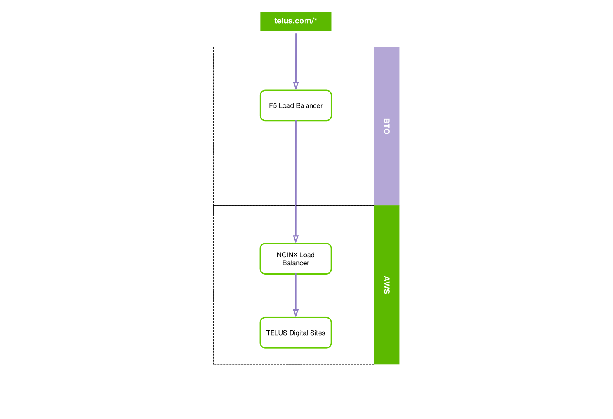

# URI Structure

## Why

TELUS digital does not fully control www.telus.com domain.  www.telus.com currently resolves to an F5 load balancer appliance that is owned by BTO.  The F5 acts as a reverse proxy and all of our routes are defined in the [inbound proxies](../delivery/inbound-proxies.md) that TELUS digital maintains.

We've been routing various paths in our inbound proxies to our applications deployed on AWS / OpenShift without any guidelines and conventions.

The purpose of this document is to drive consistency for structuring our urls and describe how traffic gets routed to our applications on www.telus.com.

## What

Every HTTP URL conforms to the syntax of a generic URI.

`scheme:[//[user[:password]@]host[:port]][/locale][/path][?query][#fragment]`

This document will be concerned with `[/locale][/path][?query]` when routing from our TELUS inbound proxies to applications on AWS / OpenShift.

## How

What belongs in `[/locale][/path]` portion of URI?

### Routing

This diagram describes the routing for a telus.com request:

Source: https://docs.google.com/drawings/d/1yUxOCdKRciYD7TvY_IXwzO2zW2G3ka4cdcX8SJfhSDA/edit

### Locale

The `[/locale]` segment describes what locale the content is intended for. The locale can contain the language and region.  Language is mandatory, and region is optional.  Example URLs:

- `www.telus.com/en/bc/internet`
- `www.telus.com/en/business`

The desired behaviour on the Reference Architecture is for applications to set the locale through the `[/locale]` URL segments.  Do **not use cookies** to set the locale.

Historically, the `[/locale]` was set through cookies on the Java & PHP stack.  The cookies would overwrite the locale that is provided through the URL.  

#### Available Locales

All locales are currently supported by the F5 routing.

For the regions, the following URI segments are supported: 

| Region | Region URI Segment |
| :---: | :---: |
| British Columbia | `bc` |
| Alberta | `ab` |
| Manitoba | `mb` |
| New Brunswick | `nb` |
| Newfoundland | `nl` |
| Northwest Territories | `nt` |
| Nova Scotia | `ns` |
| Nunavut | `nu` |
| Ontario | `on` |
| Prince Edward Island | `pe` |
| Quebec | `qc` |
| Saskatchewan | `sk` |
| Yukon | `yt` |

### Routing for www.wcstage.telus.com

We first test such routes on www.wcstage.telus.com and the configurations are maintained in the inbound.telus-gateway-staging-config [repository][telus-gateway-staging-config].

### Routing for www.telus.com

Once we have tested our rotes on www.wcstage.telus.com we can then update configurations for production.  The configurations for production are maintained in the inbound.telus-gateway-production-config [repository][telus-gateway-production-config].

### Selecting Specific Resources

- eg. `my-account/transactions/account/:ban/subscriber/:sub`

What belongs in `[?query]` portion of URI?

- Used once resources have been selected and we want to filter/sort them

## Who

Any teams deploying to www.telus.com:
- Home Marketing
- Mobility Marketing
- My Account
- Business

## References

- [RFC 6570][rfc-6570]
- [Inbound proxies](../delivery/inbound-proxies.md)
- [inbound.telus-gateway-staging-config][telus-gateway-staging-config]
- [inbound.telus-gateway-production-config][telus-gateway-production-config]

[rfc-6570]: https://tools.ietf.org/html/rfc6570 "RFC 6570"
[telus-gateway-staging-config]: https://github.com/telusdigital/inbound.telus-gateway-staging-config "inbound.telus-gateway-staging-config"
[telus-gateway-production-config]: https://github.com/telusdigital/inbound.telus-gateway-production-config "inbound.telus-gateway-production-config"
